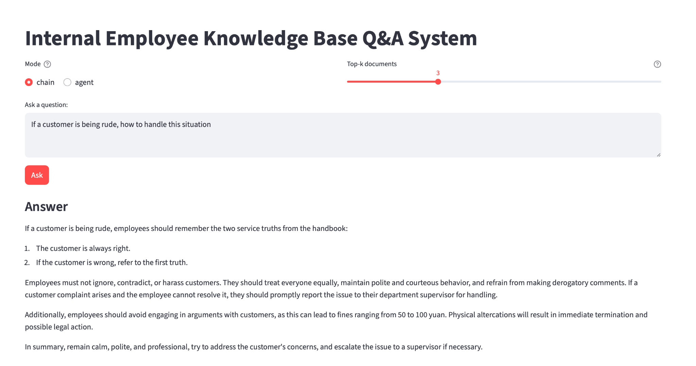
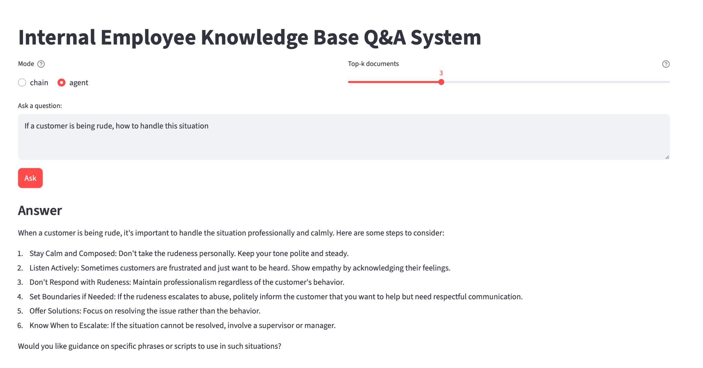
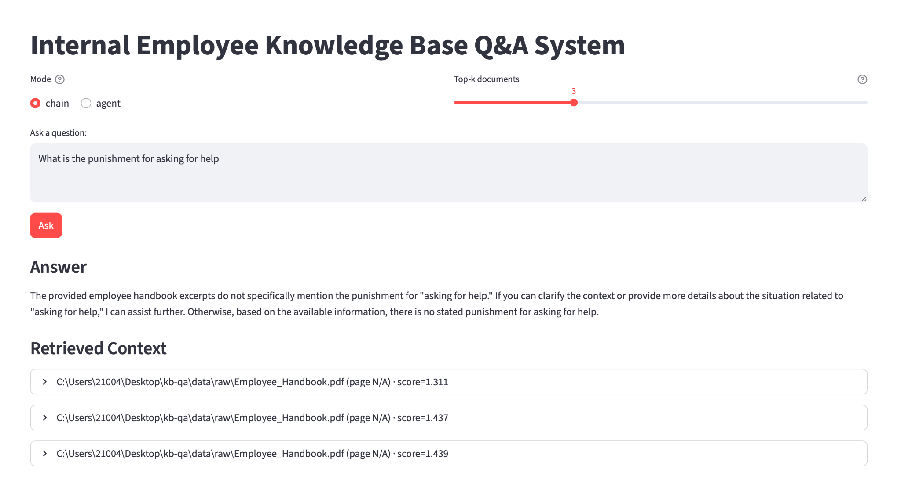

# 📚 KB-QA: Retrieval-Augmented Generation Knowledge Base System

A modular **Retrieval-Augmented Generation (RAG)** system for answering questions over internal documents using **FAISS vector search** and **LLM-powered reasoning**. The system supports both **chain-based RAG** and **agentic RAG** workflows, exposed via a **FastAPI** backend and designed for extensibility and evaluation.

---

## 🧠 Why RAG?

Large language models (LLMs) have a fixed training cutoff and may hallucinate when information is missing, outdated, or domain-specific. This limitation is especially critical for enterprises that rely on rapidly changing information such as internal policies, product specifications, regulations, and operational data.

Retrieval-Augmented Generation (RAG) addresses this challenge by enabling models to retrieve and ground responses in up-to-date, user-provided sources. A RAG system can securely hold and access vast amounts of internal knowledge—including documents, databases, code repositories, and communication records—ensuring that generated answers are accurate, traceable, and context-aware.

By grounding generation in retrieved documents, RAG significantly reduces hallucination and makes LLMs practical for:
- Internal knowledge bases  
- Enterprise Q&A systems  
- Policy, compliance, and documentation search  


---

## ✨ Features

* 🔍 **Semantic retrieval** with FAISS
* 🧠 **LLM-grounded answers** using retrieved context
* 🔗 **Chain RAG** and **Agentic RAG** modes
* 📄 **Source attribution** with similarity scores
* ⚡ **FastAPI** service layer
* 🧪 Built-in **evaluation pipeline**
* 🗂 Clean, modular project structure

---

## Example Usage

### 1. Chain Mode: Policy-Based Answering
When a user asks a question, the system retrieves the most relevant content from the employee handbook given by the user and returns an answer grounded directly in the provided policy text.



---

### 2. Agent Mode: Strategy-Oriented Guidance
In agent mode, unlike chain mode, the system does not simply copy content from the handbook. Instead, it interprets the policy and provides actionable guidance, explaining the recommended strategy and what steps the user should take in the given situation.



---

### 3. Hallucination Prevention: Unknown Questions
If a user asks a question that cannot be answered based on the provided handbook content, the system explicitly responds that the information is not available. This design prevents hallucination and ensures that answers are only generated when supported by retrieved documents.



---

## 🏗️ Architecture Overview

```
User Query
   ↓
Retriever (FAISS Vector DB)
   ↓
Top‑k Relevant Chunks
   ↓
LLM (Chain or Agent)
   ↓
Grounded Answer + Sources
```

**RAG Modes**

* **Chain RAG**: single-pass retrieval → generation (deterministic, fast)
* **Agentic RAG**: multi-step reasoning with dynamic tool usage (flexible, powerful)

---

## 📁 Project Structure

```
kb-qa/
├── app/
│   ├── main.py              # FastAPI entry point
│   ├── core/                # App configuration & initialization
│   ├── services/            # RAG logic
│   │   ├── rag_chain.py     # Chain-based RAG
│   │   ├── agent.py         # Agentic RAG
│   │   ├── vector_db.py     # FAISS vector store utilities
│   │   ├── rag_service.py   # RAG orchestration
│   │   └── build_index.py   # Index construction
│   ├── schemas/             # API request / response models
│   ├── models/              # LLM & embedding abstractions
│   └── eval/
│       └── evaluator.py     # RAG evaluation pipeline
├── data/
│   ├── raw/                 # Source documents
│   └── index/               # FAISS index files
├── tests/                   # Unit & integration tests
├── requirements.txt
├── .env
└── README.md
```

---

## 🚀 Getting Started

### 1️⃣ Environment Setup

```bash
python -m venv venv
source venv/bin/activate     
pip install -r requirements.txt
```

Create a `.env` file in the project root:

```env
OPENAI_API_KEY=your_api_key_here
```

---

### 2️⃣ Build the Vector Index

```bash
python -m app.services.build_index
```

This step:

* Loads documents from `data/raw`
* Splits text into chunks
* Generates embeddings
* Saves the FAISS index to `data/index`

---

### 3️⃣ Run the Application

```bash
uvicorn app.main:app --reload
```

The API will be available at:

```
http://127.0.0.1:8000
```

---

## 🔌 API Usage

### Query the Knowledge Base

```http
POST /rag/query
```

**Request Example**

```json
{
  "query": "What is the return policy?",
  "mode": "chain",
  "k": 5,
  "model": "gpt-4o-mini"
}
```

**Response Includes**

* Generated answer
* Retrieved document snippets
* Similarity scores
* Source metadata (file name, page)

---

## 🧪 Evaluation

Run the evaluation pipeline:

```bash
python -m app.eval.evaluator
```

Supports analysis of:

* Retrieval quality
* Context relevance
* Answer faithfulness

---

## ⚙️ Design Choices

* **FAISS** for efficient local vector search
* **Separation of concerns** between retrieval, generation, and orchestration
* **Explicit RAG modes** for experimentation and benchmarking
* **Source grounding** to reduce hallucinations
* **Config-driven models** for easy LLM swapping

---

## 📌 Future Work

* Streaming responses
* Hybrid retrieval (BM25 + vectors)
* Reranking and caching
* Improved citation formatting
* Frontend UI (Streamlit / React)

---

## 👤 Author

**Yanzhi (Jerry) Cui**
Applied Mathematics, UC Berkeley
